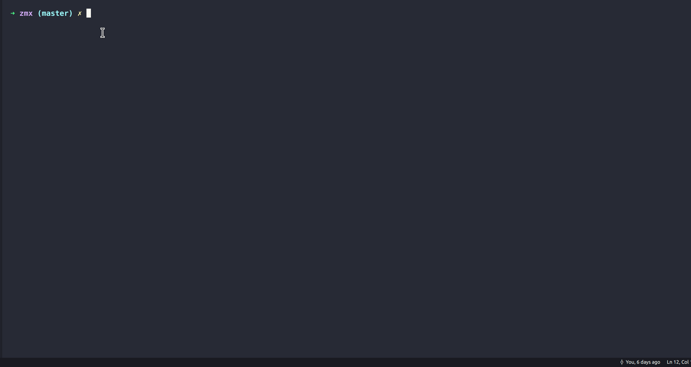

# zmx: bring M-x experience to zsh
/zmacs/
## show case

## how to install
1. install fzf first
2. `zplug "woodgear/zmx"` in you zshrc
## how to use
1. dealut bindkey is  `,xm`.
2. action come from script which file path contains `awesome`, change if you want.
3. you may use it combine with [awesome-shell-action](https://github.com/awesome-code-actions/awesome-shell-actions).
4. action(function) which has comment like '# arg-len:1' will not eval but wait you args.